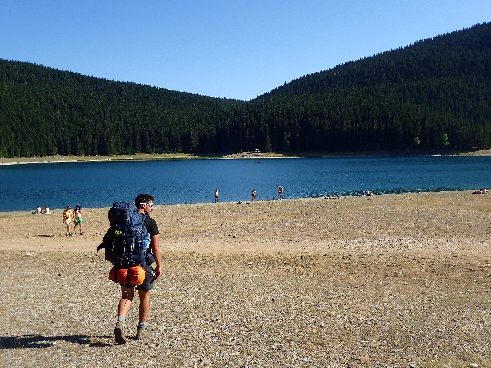
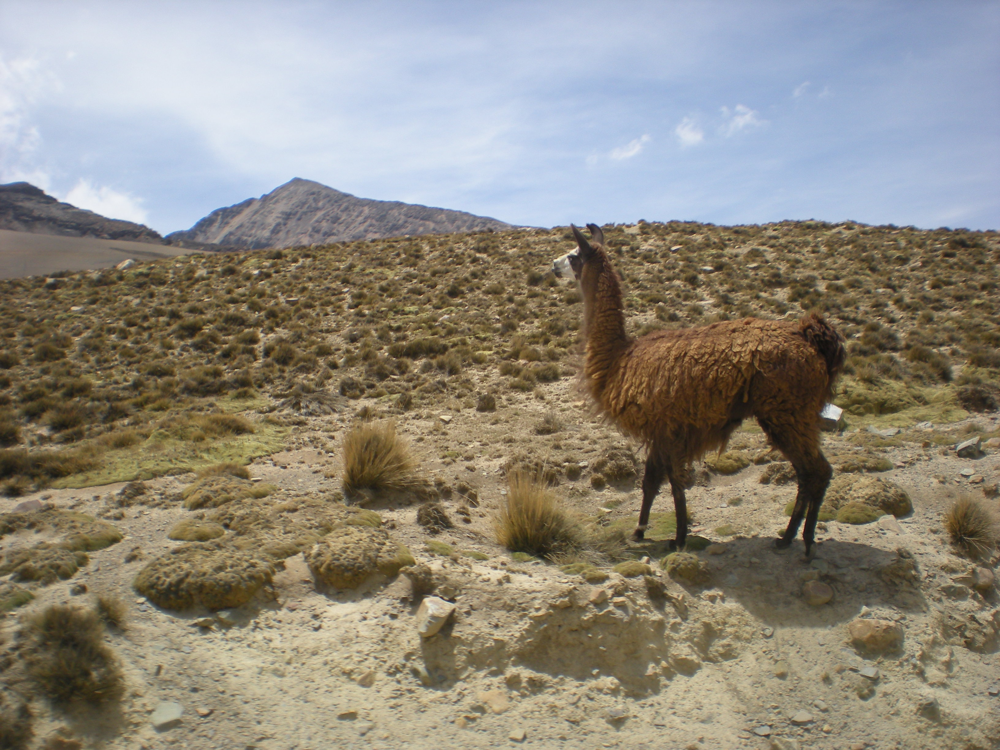
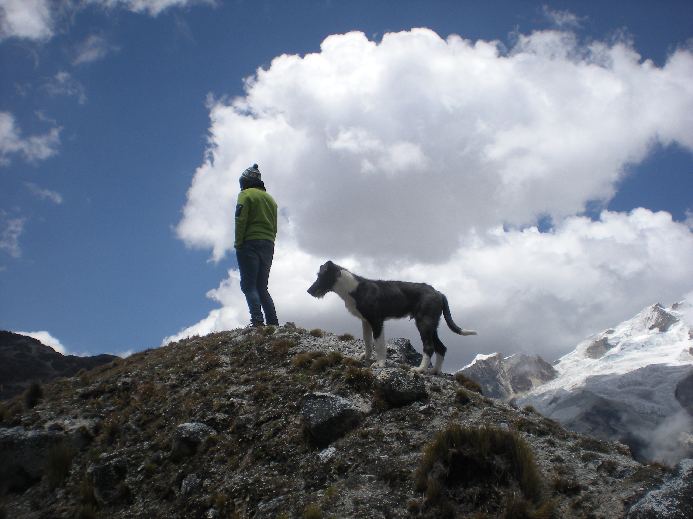

```{r setup, include=FALSE}
library(flexdashboard)
```


Row
-----------------------------------------------------------------------

### is my age

```{r}
require(dplyr)
MyDate <- as.Date("1994-11-21")
Today <- Sys.Date()
MyAge<- round(as.numeric(difftime(Today, MyDate, units = "days"))/365,0)
valueBox(MyAge, icon = "fa fa-heartbeat", color = "warning")
```

### cups of coffee is my daily routine

```{r}
cup <- 3
valueBox(cup, icon = "fa fa-coffee", color = "aqua")
```

### is the number of years I have been a boy scout

```{r}
spam <- 19
valueBox(spam, 
         icon = "fa fa-paw",
         color = "warning")
```

Row {data-height=250}
-------------------------------------


### Personallity and Passion

> Excitavit hic ardor milites per municipia plurima, quae isdem conterminant, dispositos et castella, sed quisque serpentes latius pro viribus repellere moliens, nunc globis confertos, aliquotiens et dispersos multitudine superabatur ingenti, quae nata et educata inter editos recurvosque ambitus montium eos ut loca plana persultat et mollia, missilibus obvios eminus lacessens et ululatu truci perterrens. Hac ex causa conlaticia stipe Valerius humatur ille Publicola et subsidiis amicorum mariti inops cum liberis uxor alitur Reguli et dotatur ex aerario filia Scipionis, cum nobilitas florem adultae virginis diuturnum absentia pauperis erubesceret patris.

> Excitavit hic ardor milites per municipia plurima, quae isdem conterminant, dispositos et castella, sed quisque serpentes latius pro viribus repellere moliens, nunc globis confertos, aliquotiens et dispersos multitudine superabatur ingenti, quae nata et educata inter editos recurvosque ambitus montium eos ut loca plana persultat et mollia, missilibus obvios eminus lacessens et ululatu truci perterrens. Hac ex causa conlaticia stipe Valerius humatur ille Publicola et subsidiis amicorum mariti inops cum liberis uxor alitur Reguli et dotatur ex aerario filia Scipionis, cum nobilitas florem adultae virginis diuturnum absentia pauperis erubesceret patris.

<!--
> Excitavit hic ardor milites per municipia plurima, quae isdem conterminant, dispositos et castella, sed quisque serpentes latius pro viribus repellere moliens, nunc globis confertos, aliquotiens et dispersos multitudine superabatur ingenti, quae nata et educata inter editos recurvosque ambitus montium eos ut loca plana persultat et mollia, missilibus obvios eminus lacessens et ululatu truci perterrens. Hac ex causa conlaticia stipe Valerius humatur ille Publicola et subsidiis amicorum mariti inops cum liberis uxor alitur Reguli et dotatur ex aerario filia Scipionis, cum nobilitas florem adultae virginis diuturnum absentia pauperis erubesceret patris. -->

### Places I've visited

```{r echo = FALSE, message = FALSE, comment = FALSE}
# With the takeout tool of google, I have dowloaded all my visited places from my google map. The file format is json. To open it in R I require the rjson package
require(rjson)

# then I load the db and tidy it with dplyr and tidyr #thanksHadley
require(dplyr)
require(tidyr)
p <- as_data_frame(unlist(fromJSON(file = "Map/VisitedPlaces.json")))
colnames(p) <- "Value"
p$Value <- as.numeric(p$Value)
p1 <- p %>% filter(!is.na(Value))
p1$Coordinate <- c("Long", "Lat", "Lat", "Long")

# Now I have a df of one column containing only lat and long. I create an index column representating the location in number. Then I spread Coordinate column to make the df tidy
p1$Index <- rep(c(1:390), each = 2)
p2 <- spread(p1, Coordinate, Value)

# Now I use the package leaflet to represent a nice interactive map
require(leaflet)
m <- leaflet() %>%
  addTiles() %>%  # Add default OpenStreetMap map tiles
  addMarkers(lng= p2$Long, lat= p2$Lat) 
m
```


Row {.tabset .tabset-fade}
-------------------------------------

### Montenegro 
```{r, echo = FALSE, message= FALSE}
require(knitr)

```

### Peru, Close from Cuzco
```{r, echo = FALSE, message= FALSE, out.width="50%"}
require(knitr)

```

### Bosnia-Herzegovina, Somewhere in the mountain
    
```{r, echo = FALSE, message= FALSE}
require(knitr)
include_graphics(c("Image/Passion/Fire.JPG","Image/Passion/BH.JPG"))
```

### Bolivia, Huayna Potosi
    
```{r, echo = FALSE, message= FALSE}
require(knitr)

```

### Brazil, Foz Do Iguaçu
    
```{r, echo = FALSE, message= FALSE}
require(knitr)

```
    