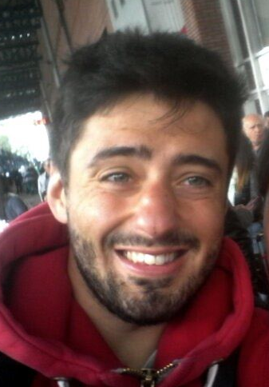

&emsp;




# **Hi, I am Pierrick!**

**[Website under construction]**

Fresh finance graduate with a passion for Sustainable Development, my studies in three different universities provided me with a holistic background in Sustainable Finance. Every day, I am doing research to collect evidence that it does pay to be green and that companies have incentives to adopt sustainable business strategies. To achieve this goal, I have developed strong data analytics skills in learning software environment for statistical computing. My main concern is doing research in a reproducible way so that others may verify my findings and build upon them to further the science and to drive ongoing progress. 

[...]

I am looking for a job opportunity that will improve my skills of data analyst and get me closer to my personal goal: *accelerate the transition towards a greener world*. 

I hope you will enjoy this website and will get to know me!


```{r echo = FALSE, message = FALSE, out.width = "5%"}
#require(knitr)
#signature <- "Image/Pierrick2.JPG"
#include_graphics(signature) 
```


